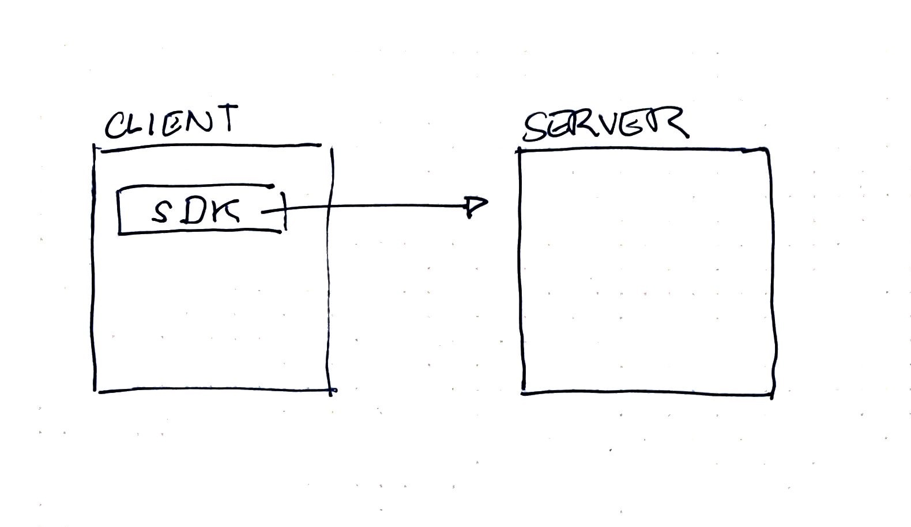

# Build a Simple Messenger Api <!-- omit in toc -->

## Table of Contents <!-- omit in toc -->
- [Introduction](#introduction)
- [One way to play around with this application](#one-way-to-play-around-with-this-application)
- [To see more interaction](#to-see-more-interaction)
- [On the wishlist](#on-the-wishlist)
- [Requirements](#requirements)

## Introduction
A very simple, unsecured, very public, incomplete messaging application.

This application experiments with the npm package [ws](https://github.com/websockets/ws#sending-and-receiving-text-data), a websocket libary.

The idea was to be as minimal as possible with implementation. I would have liked to experiment to try and see how creating the same application can be approached using vanilla Node, but I did not have enough time.



There are two main parts in this application:
- [The server](./server.js):
  - Runs the WebSocketServer on ``ws://127.0.0.1:3000``
  - Pretends to have a database by just using an object. All data will get deleted when you restart the application.
- [The SDK](./sdk.js)
  - A pretend SDK that a client can bring in and use in their application. The one instance is meant only for one user at this time.
  - When instantiated, it:
    - iniitates a connection with the WebSocket server at ``ws://127.0.0.1:3000``.
    - Registers a new user named ``Abby``.
    - Begins listening for messages
    - Returns an object with methods for the client to interact with the webserver. **Calling these methods currently does not work outside of the instantiation scope.**
    - Attempts to run the methods for validation. **This portion is only meant for hacky manual testing**
      - Sends a message to Santa. This is able to send the message through to a different client
      - Requests the latest 100 messages that the user received. The list is broadcasted but there is a disconnect where the server is not sending to the client that is waiting for the message
      - Requests the latest 100 messages that the user received from Santa. Same thing is happening with this one as the previous method.

This application has no authentication and each message is broadcasted to everyone except for where the server tries to skip sending to itself and any user can very easily pretend to be another user.

The filtering of messages happens at the SDK level where the user/client is left to pick out their messages on "good faith".

## One way to play around with this application
- Install the dependencies ``npm i``
- Run the server in one terminal ``npm start``
- In a desktop tool like Postman, connect to the websocket server with the address ``ws://127.0.0.1:3000``. [Instructions for Postman](https://blog.postman.com/postman-now-supports-socket-io/). If you decide to use postman, the UI can be a little bit tricky. If certain windows are not appearing, try expanding the whole window and dragging some section borders to get the Compose, Messages and other sections showing properly.
- From Postman you can send different messages.

Registering a user
```
{
    "type": "register",
    "to": "Santa"
}
```

Sending a user a message
```
{
    "type": "send",
    "to": "Abby",
    "from": "Santa",
    "message": "hello"
}
```

Retrieving the last 100 messages received by the user
```
{
    "type": "retrieve-all",
    "to": "Abby",
    "from": "Santa",
    "message": "hello"
}
```

Retrieving the last 100 messages received by the user from a specific sender
```
{
    "type": "retrieve-specific",
    "to": "Abby",
    "from": "Santa",
    "message": "hello"
}
```

## To see more interaction
You can run the sdk in a new terminal window using the command ``npm run client``. It should try to run the three methods as described above.

If you send more messages using postman to a user named 'Abby', then you can send 'Abby' messages with postman.

## On the wishlist
- Investigate alternatives to ensure messages are only sent to the intended receiver.
  - Is it possible to create new event types with ``ws``?
  - Should a new library like socket.io be used?
  - Would it be possible to recreate using vanilla Node.js
- What is happening with the message lists not getting to the correct client?
- Automated testing
  - Portions like each method case can be pulled out of the server or sdk to enable unit testing each piece directly.
  - Integration testing. I have not been able to complete runnning automated tests against the WebSocketServer. There is an issue with running the server in a child process and trying to create a new connection within a test outside of the child process.
- Cleanup
  - Handle closing of connections and the server.
- Error Handling
  - Handle people trying to send messages when they are not registered
  - Handle people trying to send messages as someone else
  - Handle people trying to register an existing username.
- CI/CD Pipeline with develop and master branch protections and automated test runs.
- Pre-commit hooks to check for linting and other errors.
- Github templates for Pull requests

## Requirements
- [x] A short text message can be sent from one user (the sender) to another
(the recipient).
- [x] Recent messages can be requested for a recipient from a specific sender with a limit of 100 messages or all messages in last 30 days.
- [x] Recent messages can be requested from all senders - with a limit of 100.
messages or all messages in last 30 days.
- [x] Document your api like you would be presenting to a web team for use.
- [x] Show us how you would test your api.
- [x] Ensure we can start / invoke your api.